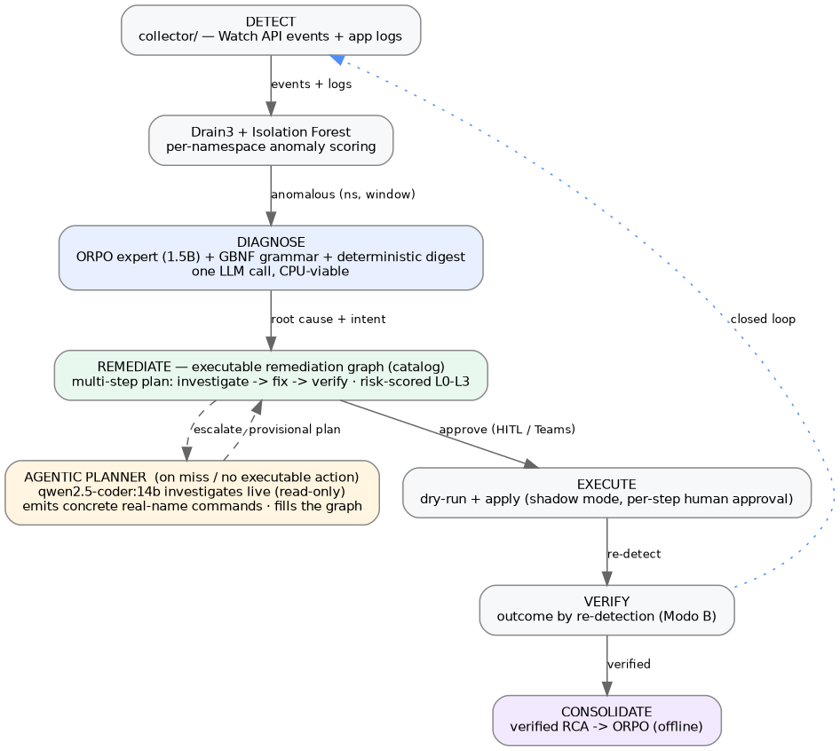

# K8s-AIOps: An On-Premise Closed-Loop AIOps Pipeline for Kubernetes — Small-Model Diagnosis, an Executable Remediation Graph, and Agentic Escalation

## Abstract

This work presents an end-to-end, on-premise AIOps pipeline for Kubernetes that closes the loop from **detection** to **diagnosis** to **remediation** to **verification** to **consolidation**, without any observability infrastructure (no Loki, Prometheus, or in-cluster agents) and without a GPU on the diagnosis path. Anomalies are detected per `(namespace, window)` with Isolation Forest over control-plane events and application logs. Root-cause diagnosis runs on a **single fine-tuned small language model** — `Qwen2.5-1.5B` aligned with ORPO, served under a GBNF grammar and enriched by a zero-cost deterministic *evidence digest* — chosen because it produces specific, format-correct diagnoses while remaining viable on CPU (~0.7 s on GPU, ~32 s on CPU, one LLM call). The model **diagnoses but never decides the action**: remediation is served by a deterministic, auditable **executable knowledge graph** that maps each problem signature to a multi-step plan (investigate → fix → verify), risk-scored and gated by dry-run plus per-step human approval under shadow mode. For novel problems the graph does not cover, an **agentic escalation planner** (a larger local code model, `qwen2.5-coder:14b`, loaded on-demand on the same GPU that hosts the resident expert) **investigates the live cluster** read-only and proposes a concrete, real-name-bound plan from a curated safe-write vocabulary — there are **no manual steps**: every plan step is an executable command, and genuinely external fixes surface as a note rather than a checkbox. Outcomes verify plans by re-detection and feed a closed learning loop that consolidates verified diagnoses back into the model. The same read-only investigation pipeline also powers an operational console (live dashboard, incident inbox with step-by-step execution, cluster topology, a security-posture scanner, and a browsable view of the remediation graph). A condensed account of the alignment study that produced the diagnosis model is included; the full ten-experiment development log is preserved separately in `RESEARCH_v1.md`.

## Introduction

Site Reliability Engineers operating Kubernetes clusters spend a large share of their time triaging alert noise. A production cluster emits thousands of events per hour, of which only a fraction are actionable; correlating those signals to a root cause and a safe remediation requires expertise that rule engines capture poorly. General-purpose Large Language Models can help, but using them as real-time triage components carries operational cost (API latency and spend, hardware, and — decisively for many on-premise operators — sending cluster internals to a third party).

This system takes a different stance, built on three principles:

1. **Small, local, specialised.** A 1.5B-parameter model, fine-tuned on Kubernetes incidents, runs the diagnosis on commodity CPU. No GPU is required at inference time for diagnosis, and nothing leaves the cluster's network.
2. **The model diagnoses; deterministic code acts.** A small model cannot be made reliable enough to *choose and execute* a cluster-mutating action. So the action is never the model's free-text output: it is resolved from an auditable knowledge graph and validated/risk-scored before any execution, with a human in the loop.
3. **Closed loop, infrastructure-free.** Everything runs on read-only access to the Kubernetes API. Detection, diagnosis, remediation, verification and learning form a cycle that improves with use, and the only writes to the cluster are reversible/configuration actions a human approves.

The remainder of the paper describes the system as it runs today, including the *Fine-tuning and alignment* section that summarises the ten-experiment study behind the diagnosis model. The exhaustive per-experiment development log lives in `RESEARCH_v1.md`.

## System Overview

The pipeline is a closed loop. Each stage uses only read-only Kubernetes API access; the single class of writes is a curated set of reversible/configuration remediation commands, each behind dry-run, shadow mode and explicit per-step human approval.

**Operational console.** A FastAPI + WebSocket console exposes five read-only views (Dashboard, Incidents, Topology, Security, Graph). It is the human-in-the-loop control point: Microsoft Teams notifications alert and deep-link here, and approvals/executions happen in the authenticated console.

**Current production configuration.** Diagnosis runs the single-shot ORPO expert under GBNF grammar with a deterministic evidence digest. Remediation runs the executable graph plus the agentic escalation planner. The Hybrid ReAct Agent and the alternative diagnosis modes (documented in `RESEARCH_v1.md`) remain selectable but are not the default — the hybrid's multi-call investigation exceeds the CPU detection budget (see *Diagnosis*).

## Detection

Detection consumes two read-only sources and feeds a single unsupervised pipeline.

- **Control-plane events** via the Kubernetes Watch API (`Pulled`, `BackOff`, `OOMKilling`, `FailedScheduling`, …). Events are sparse: a healthy cluster emits very few.
- **Application logs** (`read_namespaced_pod_log`, bounded by `since_seconds`/`tail_lines`/`max_pods`). This captures app-level signal — errors, stack traces, failed init — that never surfaces as a Kubernetes event. On the production cluster, enabling logs raised per-window signal from 1–2 events to 600+ lines across 34 namespaces.

Both streams are templated with **Drain3** (online log-template mining) and aggregated into 60 s sliding windows (stride 30 s). Per window, features include event frequency, warning ratio, distinct templates, backoff count and error rate, scored by an **Isolation Forest** (`contamination=0.05`, `n_estimators=100`) retrained continuously.

Two hardening decisions are load-bearing:

- **Per-namespace scoring.** The unit of analysis is `(namespace, window)`, not `window`. Each namespace is scored separately and the culprit is the arg-max, so a single noisy namespace cannot mask or trigger false anomalies elsewhere.
- **Absolute anomaly score.** The detector uses Isolation Forest's `decision_function` (an absolute reference) instead of per-batch min–max normalisation. This eliminated an anomaly *flood*: normal windows score low in absolute terms, and only genuinely anomalous namespaces fire.

A novelty warm-up after every (re)start prevents the first windows — when the model has seen little — from over-firing.

## Diagnosis: a single fine-tuned small model

The diagnosis layer answers, for an anomalous `(namespace, window)`: *what is the root cause, and what is the relevant kubectl command?* It runs **one** call to a fine-tuned expert and emits a `ROOT CAUSE` (Spanish, specific) plus a `KUBECTL` line.

### The model

The base is `Qwen2.5-1.5B-Instruct`, fine-tuned with **QLoRA + ORPO** on ~986 curated Kubernetes incident scenarios spanning 14 failure categories, served as a Q8_0 GGUF (~1.6 GB) via Ollama. Two mechanisms make its output reliable:

- **GBNF grammar.** The expert is called through Ollama's `/api/generate` with a grammar that constrains output to the `ROOT CAUSE: … / KUBECTL: …` shape. This guarantees format at the token level and decouples format correctness from model capacity.
- **Deterministic evidence digest.** Before the call, `evidence_digest()` counts the dominant Kubernetes failure reasons already present in the evidence (OOMKilling / Evicted / FailedScheduling / ImagePullBackOff …) and prepends them to the prompt. It is pure code — no second LLM, no cluster access — and recovers most of the diagnostic accuracy a separate investigator model would add.

### Hybrid vs single-shot: the production decision

Two diagnosis configurations were measured head-to-head: the **single-shot expert** (one call to the ORPO model under grammar, plus the deterministic digest) and the **Hybrid ReAct Agent** (a vanilla `qwen2.5:1.5b` investigator that drills into the failing pod, then the ORPO expert synthesises). The hybrid is the stronger *diagnostician* — its investigation recovers the baseline's vocabulary (Keyword 92.9% vs the single-shot's 78.1% raw / 83.3% with the digest) and unlocks blind spots such as `network_policy_block` (0% → 73.3%). The decision, however, is dominated by **latency on CPU**, where the diagnosis must run without a GPU:

| Configuration | Keyword% | Parse% | Latency (GPU) | Latency (CPU) |
|---|:---:|:---:|:---:|:---:|
| Single-shot + grammar + digest | 83.3% | ~100% | ~0.86 s | **~32 s** (fits the 60 s budget) |
| Hybrid ReAct + grammar | **92.9%** | 98.6% | ~2.3 s | **> 60 s** (over budget) |

*Detection windows are 60 s; a diagnosis slower than the window cannot keep pace. CPU figures on the Xeon Gold 6526Y: single-shot ORPO Q8 measured 36.2 s mean (4 vCPU) and 32.6 s (8 vCPU).*

On a GPU both modes are sub-3 s and the hybrid's higher Keyword% wins. **On CPU the calculus flips**: both latencies rise sharply, but only the single-shot fits under the 60 s detection budget — the hybrid's extra investigator call pushes its multi-call path past it. Critically, the single-shot **still generates specific, format-correct Spanish diagnoses**: the GBNF grammar guarantees the structure, and the zero-cost deterministic digest recovers most of the lost vocabulary (Keyword 71.4% → 83.3%, NS-ok 95.2% → 97.6% on a 42-sample held-out subset) at unchanged latency. The production system therefore runs **single-shot**, trading ~10 points of Keyword% for being the only mode that keeps pace on CPU; the hybrid stays selectable (`react_mode: hybrid`) where a GPU budget allows.

### Deterministic guardrails on the diagnosis output

Diagnosis quality is made independent of model variance by post-processing:

- **Deterministic command builder.** A catalog maps the detected intent to a targeted, namespace-correct kubectl command, extracting the real resource from the evidence and discarding fragile commands. This lifts command quality from the raw model's NS-ok 33% / Verb-ok 41% to **85.7% / 92.9%**, and attaches a natural-language explanation of what each command does and what to look for.
- **Anti-drift fallback.** If the model output is unusable (apology/drift markers), the root cause is synthesised deterministically from the dominant error template, so the system never shows "no determinable cause" when real errors exist.
- **Incident classification & deduplication.** Each incident is tagged App vs Platform and deduplicated by fingerprint with an occurrence counter, preserving event+log correlation in a single store.

## Fine-tuning and alignment: ten experiments

The diagnosis model is the product of a systematic alignment study — ten fine-tuning experiments on `Qwen2.5-1.5B-Instruct` — whose objective was a small model that emits *both* a correct root cause *and* a parseable `ROOT CAUSE / KUBECTL` structure. The full per-experiment log, including the failed recipes and the Gemma-4 capacity experiment, is preserved in `RESEARCH_v1.md`; this section summarises the journey and its result.

### Training setup

QLoRA (4-bit quantised base + trainable LoRA adapters) on a single **NVIDIA A30 (24 GB)** with unsloth + TRL, over a curated dataset of **~986 Kubernetes incident scenarios across 14 failure categories** (OOM, CrashLoop, ImagePull, liveness/readiness probes, PVC binding, node pressure, NetworkPolicy, registry auth, …). Each sample is ChatML — a system role, an events/logs prompt, and a `ROOT CAUSE … / KUBECTL …` completion. The aligned adapters are merged and quantised to **Q8_0 GGUF (~1.6 GB)**; Q8 is chosen over Q4, since 4-bit quantisation measurably degrades a 1.5B model's format adherence.

### The three paradigms and the central finding

The experiments span three paradigms: (1) single-shot fine-tuning (SFT, DPO, SimPO, ORPO, KTO); (2) grammar-constrained decoding; and (3) a two-phase Hybrid ReAct Agent. They expose a persistent **Parse%/Keyword% trade-off**: methods that enforce output *format* (SFT, ORPO) cap semantic *vocabulary* coverage, while preference-optimization methods that recover vocabulary (DPO, SimPO, KTO) destroy format. The trade-off is not fundamental — it is the cost of solving both objectives with one small model on a restricted dataset.

| Experiment | Method | Parse% | Keyword% | NS-ok% | ROUGE-L | Lat. |
|---|---|:---:|:---:|:---:|:---:|:---:|
| Baseline | none (`qwen2.5:1.5b`) | 38.6% | 92.4% | 1.4% | 2.5% | 1.00 s |
| SFT v1 | SFT | 56.2% | 60.0% | 32.9% | 56.7% | 0.86 s |
| SFT v2 | SFT (balanced) | 35.2% | 64.3% | 22.4% | 41.2% | 0.89 s |
| DPO v1 | DPO | 16.2% | 82.9% | — | 2.4% | — |
| SimPO | SimPO | 16.7% | 86.7% | — | 57.7% | — |
| DPO v2 | DPO (format both sides) | 8.1% | 87.1% | 6.2% | 21.7% | 0.81 s |
| ORPO | ORPO (Q8_0) | 58.1% | 67.1% | 48.1% | 16.2% | 0.89 s |
| ORPO | ORPO (Q4_K_M) | 59.5% | 76.2% | 45.7% | 14.7% | 0.85 s |
| KTO | KTO | 0.0% | 0.0% | 0.0% | 0.0% | 0.49 s |
| **ORPO + grammar** | ORPO + GBNF | **100.0%** | 78.1% | **89.5%** | 19.3% | **0.71 s** |
| **Hybrid ReAct + grammar** | role separation | 98.6% | **92.9%** | 73.3% | 5.9% | 2.04 s |

*210 blind samples per model, seed=99. The trade-off is visible column-wise: SFT/ORPO raise format and NS-ok but cap Keyword%; DPO/SimPO/KTO raise Keyword% but collapse Parse%.*

### Why ORPO + grammar, then single-shot

**ORPO** (Odds-Ratio Preference Optimization) is the first method to optimise format and vocabulary *simultaneously* by construction — it folds the preference signal into the SFT loss rather than as a separate, format-destroying stage (as DPO does). Adding **GBNF grammar-constrained decoding** then guarantees the `ROOT CAUSE/KUBECTL` structure at the token level (Parse% 58% → 100%), decoupling format correctness from model capacity. The **Hybrid ReAct Agent** showed the trade-off is fully separable — a vanilla investigator feeding the ORPO expert recovers the baseline's Keyword% (92.9%) — but its multi-call latency does not fit a CPU budget (previous section). The production system therefore runs the single-shot ORPO expert + grammar + a deterministic evidence digest. A separate capacity experiment (Gemma-4-E2B + ORPO, in `RESEARCH_v1.md`) confirmed that a larger base improves the one axis guardrails cannot fix (vocabulary), but is not viable on the on-premise CPU/Ollama stack — reinforcing the 1.5B + grammar + digest choice.

## Remediation: an executable knowledge graph

A diagnosis maps to *one* command, but real failures often need a *sequence* — investigate → identify → fix → verify — and one command rarely resolves them (an ingress 5xx is not fixed by restarting the controller if the backend has no Ready endpoints or a NetworkPolicy drops the traffic). The remediation layer is therefore a **non-parametric, structured, executable memory**: a knowledge graph of multi-step plans, mirroring the closed learning loop but for *remediation* rather than diagnosis.

- **Node = abstract problem signature** (intent + workload class), portable across clusters.
- **Edge = a remediation step** with an action *template* (placeholders `{ns}`, `{pod}`, `{workload}`, `{service}`, `{pvc}`, `{node}`), a `risk_level` and a `source` (`catalog` or `escalated`).
- **Binding** (real namespace/resources) is resolved at runtime by the same deterministic extractors as the diagnosis layer. **Retrieval is done by code** (intent detection + lookup, with an embedding nearest-neighbour fallback for escalated nodes), never by the small model — which never loads the graph into its context. The store is SQLite (`src/remediation/remediation_graph.py`).

The graph is **seeded from the existing command catalog** (idempotent), so it starts full with everything the system already knew how to do — introducing it cannot regress command quality. Each step type is `investigate` (read-only) or `command` (a reversible/config write). **There are no manual (`guidance`) steps**: every step is executable. Where a failure's only fix is genuinely external, the plan returns the investigation steps plus an "external action required" note — never a checkbox.

### Risk taxonomy and execution

Every command is risk-scored before it can run:

| Level | Class | Examples | Execution |
|---|---|---|---|
| L0 | Read-only | `get`, `describe`, `logs`, `top`, `events` | Runs freely (investigation) |
| L1 | Reversible | `rollout restart`/`undo`, `scale` | Dry-run + per-step approval |
| L2 | Configuration | `set image`, `set resources`, `set env` | Dry-run + per-step approval |
| L3 | Destructive | `delete`, `drain`, `cordon`, `exec`, `apply`, `create`, `patch` | **Never executed** (notified for human action) |

Execution always runs a dry-run first (for commands that support it), then the real command, under **shadow mode** with explicit per-step operator approval. A circuit breaker blocks repeated attempts on the same fingerprint (3 in 10 min) to prevent loops.

## Agentic escalation: the large model on the long tail

When the graph has no plan for a signature (a miss), or the resolved plan has no executable action (the case that used to end in a manual instruction), the system **escalates** to an agentic planner — disabled by default, pluggable across `anthropic`/`openai`/`ollama` backends, and in production set to a **local** model.

The planner runs a ReAct loop: THOUGHT → ACTION (read-only `kubectl` through the same allow-listed toolbox) → OBSERVATION, repeated up to a step budget, and then emits a multi-step plan that uses the **real resource names it observed** — eliminating the `<pod>`/`<deployment>` placeholders a blind single call tends to produce. The plan is validated against the same safe vocabulary as the catalog (read verbs plus `rollout restart`/`undo`, `scale`, `set image`/`resources`/`env`); destructive verbs and unresolved placeholders are rejected. If the only fix needs a forbidden verb (create a secret with an unknown value, provision a PV, add node capacity), the planner returns investigation-only and the incident carries the "external action required" note. A validated plan is persisted as **provisional** in the graph (with a signature embedding) so future misses reuse it without another model call.

**On-demand on the A30.** In production the planner is `qwen2.5-coder:14b`, loaded on-demand on the same A30 that hosts the resident ORPO expert (~2 GB). On a miss, Ollama loads the coder (~15 GB resident, both models at 100% GPU, ~7 GB headroom), it investigates and persists the plan, then idle-unloads — so steady-state VRAM cost is just the small expert. This preserves the thesis: the **diagnosis** path stays on the small CPU-viable expert, and the **large model only acts on the long tail**, producing an auditable, real-name-bound, read-only-then-reversible plan rather than free-form text. A live production miss produced, for an `inventory-api` CrashLoopBackOff diagnosed as OOM, a concrete `kubectl set resources deployment/inventory-api --limits=memory=256Mi` after investigating the pod's current limits — visible in the Graph view under the *escalated* filter, awaiting outcome verification.

## Closed-loop learning

The loop that improves diagnosis is driven by a **free outcome signal**, not new labels.

- **Verify by re-detection (Modo B).** After an approved plan executes, the system waits and re-runs detection on the same target. Resolution (the anomaly clears) or persistence is recorded against the incident.
- **Graph verification.** When an incident whose plan came from the graph reaches a terminal state, its edges are marked **verified** (resolved + approved) or the failed attempt is recorded — reusing the same signal across both halves of the incident.
- **Consolidation into weights.** `graph_to_orpo.py` exports, offline, only the **diagnoses** whose solution came from the graph and was verified by outcome, as an ORPO dataset. It deliberately does not retrain *solutions* (the graph serves those deterministically and auditably) — only the diagnostic prose, labelled by causes that remediation confirmed. A fast RAG memory captures human corrections instantly; consolidation into weights is the slow path, behind a non-regression gate.

The system thus consolidates **both halves** of an incident — the diagnosis (via ORPO) and the remediation (via the graph) — each backed by the same outcome-verified, human-in-the-loop signal.

## Operational console

A FastAPI + WebSocket console, built entirely on read-only API access, exposes five views:

| View | Purpose |
|---|---|
| **Dashboard** | The algorithm live: Drain3 templates, Isolation Forest PCA scatter, scored windows |
| **Incidents** | Operations inbox: diagnosis + multi-step plan with **per-step play buttons** (live `▶ → ⟳ → ✓`), under shadow mode |
| **Topology** | Live cluster map (flow graph + "electrical panel") coloured by health, from 5 read-only list calls |
| **Security** | Rule-based posture scanner: ~10 deterministic checks by severity |
| **Graph** | Browse the remediation graph: problem signatures, multi-step plans, source (catalog vs agentic-escalated) and verification state |

Notifications are pluggable (Microsoft Teams primary, email fallback): they alert and deep-link, and the human decision happens in the authenticated console. The **security scanner** extends the same read-only investigation from operational anomalies to security risk (privileged containers, hostNetwork/hostPath, mutable image tags, missing limits, cluster-admin bindings, namespaces without NetworkPolicy); on the production cluster it surfaced 353 findings (31 critical) in under a second, with nothing installed.

## Results

**Diagnosis.** The production single-shot expert + grammar + digest reaches Parse ≈100%, Keyword 83.3%, NS-ok 97.6% on held-out evaluation, at ~0.86 s on GPU and ~32 s on CPU with a single LLM call (table in *Diagnosis*). The deterministic command builder lifts command quality to NS-ok 85.7% / Verb-ok 92.9%.

**Remediation graph.** Over the 14 project failure scenarios the catalog returns a correct-intent, namespace-bound plan for **every** scenario (coverage 100%, intent 100%, NS-ok 100%). About 50% of plans are multi-step *by design*: classes with an in-cluster reversible fix (config, secret, probe, OOM, network, readiness) resolve fully in the catalog, while the rest (image pull, node pressure, PVC binding, insufficient CPU, registry auth) return investigation-only and are handed to the agentic planner, which emits a concrete config write where one exists or an "external action required" note otherwise. No step is ever a manual checkbox.

**Production.** Running continuously on a ~34-namespace cluster, the system sustains per-namespace detection with dual event+log signal, expert-only diagnosis in Spanish with zero grammar parse failures, deterministic targeted commands, and on-demand agentic escalation that has already filled the graph with a verified-pending real-name plan.

## Related work

Recent agentic SRE tooling — HolmesGPT (ReAct over observability data), K8sGPT (scanner + LLM explanation), Aurora (LangGraph workflows) — is largely BYO-LLM and oriented to cloud/GPU models and existing observability stacks. This system's differentiators are: (1) a **fine-tuned small model on CPU**, on-premise, no data egress; (2) a **deterministic, auditable action layer** (the model never executes free-text commands); (3) a **closed loop** with outcome-verified consolidation; and (4) **infrastructure-free** operation on read-only API access, with the large model confined to on-demand escalation on the long tail.

## Limitations and future work

- **Diagnosis accuracy ceiling.** Single-shot Keyword% (83.3%) trails the hybrid (92.9%); the gap is the investigator's reasoning, which a deterministic digest cannot fully replicate. Closing it without re-introducing CPU latency is open.
- **External fixes remain external.** Failures whose remediation lives outside the cluster (provision a PV, add node capacity, create a secret with an unknown value) are surfaced as notes, not automated — by design.
- **Next.** Integration testing with chaos injection on a live cluster and MTTR measurement; a benchmark of the diagnosis model against GPT-4o/Claude on the same blind test set; periodic consolidation of the verified graph into ORPO; and scaling the base model (7B) if a GPU inference budget becomes available.

## Conclusion

A 1.5B model, fine-tuned and grammar-constrained, is enough to *diagnose* Kubernetes incidents accurately on CPU — provided the *action* is taken out of the model and given to a deterministic, auditable, human-gated remediation graph, with a larger local model confined to on-demand escalation on the long tail. The result is a closed loop — detect, diagnose, remediate, verify, consolidate — that runs on-premise, without GPU on the diagnosis path, without observability infrastructure, and without ever letting a small model execute a free-text command against a production cluster.

> **Development history.** The ten-experiment alignment study (SFT, DPO v1/v2, SimPO, ORPO, KTO), the Hybrid ReAct Agent, the Gemma-4-E2B capacity experiment, and the full production-hardening log are preserved in `RESEARCH_v1.md`. Detection internals (Watch API, Drain3, Isolation Forest) are detailed in `RESEARCH_DETECTION.md`.
