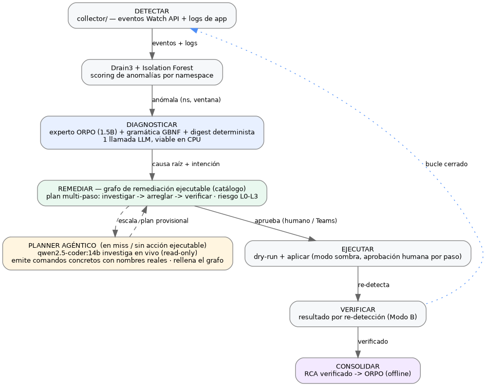

# K8s-AIOps: un pipeline AIOps de bucle cerrado on-premise para Kubernetes — diagnóstico con un modelo pequeño, un grafo de remediación ejecutable y escalado agéntico

## Resumen

Este trabajo presenta un pipeline AIOps de extremo a extremo, on-premise, que cierra el bucle de **detección** → **diagnóstico** → **remediación** → **verificación** → **consolidación**, sin infraestructura de observabilidad (sin Loki, Prometheus ni agentes dentro del cluster) y sin GPU en la ruta de diagnóstico. Las anomalías se detectan por `(namespace, ventana)` con Isolation Forest sobre eventos del plano de control y logs de aplicación. El diagnóstico de causa raíz corre sobre un **único modelo de lenguaje pequeño fine-tuneado** — `Qwen2.5-1.5B` alineado con ORPO, servido bajo una gramática GBNF y enriquecido por un *digest* determinista de la evidencia (coste cero) — elegido porque produce diagnósticos específicos y con formato correcto siendo viable en CPU (~0,7 s en GPU, ~32 s en CPU, una sola llamada al LLM). El modelo **diagnostica pero nunca decide la acción**: la remediación la sirve un **grafo de conocimiento ejecutable**, determinista y auditable, que mapea cada firma de problema a un plan multi-paso (investigar → arreglar → verificar), puntuado por riesgo y con dry-run más aprobación humana por paso en modo sombra. Para problemas novedosos que el grafo no cubre, un **planner agéntico** (un modelo de código local más grande, `qwen2.5-coder:14b`, cargado bajo demanda en la misma GPU que aloja al experto residente) **investiga el cluster en vivo** en solo lectura y propone un plan concreto, enlazado a nombres reales, de un vocabulario seguro de escritura — **no hay pasos manuales**: cada paso del plan es un comando ejecutable, y los arreglos genuinamente externos aparecen como una nota en vez de un checkbox. Los resultados verifican los planes por re-detección y alimentan un bucle de aprendizaje cerrado que consolida los diagnósticos verificados de vuelta al modelo. El mismo pipeline de investigación read-only impulsa también una consola operativa (dashboard en vivo, bandeja de incidencias con ejecución paso a paso, topología del cluster, un escáner de postura de seguridad y una vista navegable del grafo de remediación). Se incluye un resumen del estudio de alineación que produjo el modelo de diagnóstico; el registro completo de los diez experimentos de desarrollo se conserva aparte en `RESEARCH_v1.md`.

## Introducción

Los SRE que operan clusters de Kubernetes dedican gran parte de su tiempo a triar ruido de alertas. Un cluster en producción emite miles de eventos por hora, de los que solo una fracción son accionables; correlacionar esas señales con una causa raíz y una remediación segura exige un conocimiento que los motores de reglas capturan mal. Los grandes modelos de lenguaje (LLM) de propósito general ayudan, pero usarlos como componentes de triaje en tiempo real tiene coste operativo (latencia y gasto de API, hardware y — decisivo para muchos operadores on-premise — enviar las interioridades del cluster a un tercero).

Este sistema adopta una postura distinta, sobre tres principios:

1. **Pequeño, local, especializado.** Un modelo de 1.5B parámetros, fine-tuneado sobre incidencias de Kubernetes, ejecuta el diagnóstico en CPU de commodity. No se requiere GPU en inferencia para el diagnóstico, y nada sale de la red del cluster.
2. **El modelo diagnostica; el código determinista actúa.** Un modelo pequeño no puede hacerse lo bastante fiable como para *elegir y ejecutar* una acción que mute el cluster. Por eso la acción nunca es la salida libre del modelo: se resuelve desde un grafo de conocimiento auditable y se valida/puntúa por riesgo antes de cualquier ejecución, con un humano en el bucle.
3. **Bucle cerrado, sin infraestructura.** Todo corre sobre acceso read-only a la API de Kubernetes. Detección, diagnóstico, remediación, verificación y aprendizaje forman un ciclo que mejora con el uso, y las únicas escrituras al cluster son acciones reversibles/de configuración que un humano aprueba.

Enmarcamos la evaluación en cuatro preguntas de investigación:

- **RQ1 — Diagnóstico.** ¿Puede un modelo de 1.5B fine-tuneado diagnosticar incidencias de Kubernetes de forma competitiva con LLMs frontera (GPT-4o, Claude) bajo restricciones on-premise/CPU?
- **RQ2 — Remediación.** ¿Produce el grafo determinista + el escalado agéntico planes *ejecutables y seguros* (sin pasos manuales, sin comandos inseguros) en todo el espacio de fallos?
- **RQ3 — Bucle cerrado en producción.** ¿Con qué rapidez y precisión detecta y diagnostica el sistema vivo fallos inyectados, y qué parte del MTTR automatiza?
- **RQ4 — Coste del escalado.** ¿Qué aporta el planner agéntico sobre una llamada ciega single-shot, y a qué latencia?

El resto del paper describe el sistema tal como funciona hoy (incluida la sección de *Fine-tuning y alineación*) y responde a RQ1–RQ4 en *Resultados*. El registro exhaustivo por experimento vive en `RESEARCH_v1.md`.

## Visión general del sistema

El pipeline es un bucle cerrado. Cada etapa usa solo acceso read-only a la API de Kubernetes; la única clase de escrituras es un conjunto curado de comandos de remediación reversibles/de configuración, cada uno tras dry-run, modo sombra y aprobación humana explícita por paso.

**Consola operativa.** Una consola FastAPI + WebSocket expone cinco vistas read-only (Dashboard, Incidencias, Topología, Seguridad, Grafo). Es el punto de control con humano en el bucle: las notificaciones de Microsoft Teams avisan y enlazan aquí, y las aprobaciones/ejecuciones ocurren en la consola autenticada.

**Configuración de producción actual.** El diagnóstico corre el experto ORPO single-shot bajo gramática GBNF con un digest determinista de la evidencia. La remediación corre el grafo ejecutable más el planner agéntico. El Agente Híbrido ReAct y los modos de diagnóstico alternativos (documentados en `RESEARCH_v1.md`) siguen siendo seleccionables pero no son el default — la investigación multi-llamada del híbrido supera el presupuesto de detección en CPU (ver *Diagnóstico*).

## Detección

La detección consume dos fuentes read-only y alimenta un único pipeline no supervisado.

- **Eventos del plano de control** vía la Watch API de Kubernetes (`Pulled`, `BackOff`, `OOMKilling`, `FailedScheduling`…). Los eventos son escasos: un cluster sano emite muy pocos.
- **Logs de aplicación** (`read_namespaced_pod_log`, acotados por `since_seconds`/`tail_lines`/`max_pods`). Esto captura señal a nivel de app — errores, trazas, fallos de init — que nunca genera un evento de Kubernetes. En el cluster de producción, activar logs elevó la señal por ventana de 1-2 eventos a más de 600 líneas en 34 namespaces.

Ambos flujos se plantillan con **Drain3** (minería online de plantillas de log) y se agregan en ventanas deslizantes de 60 s (paso 30 s). Por ventana, las características incluyen frecuencia de eventos, ratio de warnings, plantillas distintas, conteo de backoff y tasa de error, puntuadas por un **Isolation Forest** (`contamination=0.05`, `n_estimators=100`) reentrenado en continuo.

Dos decisiones de endurecimiento son determinantes:

- **Scoring por namespace.** La unidad de análisis es `(namespace, ventana)`, no `ventana`. Cada namespace se puntúa por separado y el culpable es el arg-max, de modo que un único namespace ruidoso no puede enmascarar ni disparar falsas anomalías en otros.
- **Score de anomalía absoluto.** El detector usa el `decision_function` del Isolation Forest (referencia absoluta) en vez de la normalización min-max por lote. Esto eliminó un *flood* de anomalías: las ventanas normales puntúan bajo en términos absolutos y solo disparan los namespaces genuinamente anómalos.

Un warm-up de novedad tras cada (re)arranque evita que las primeras ventanas — cuando el modelo ha visto poco — disparen en exceso.

## Diagnóstico: un único modelo pequeño fine-tuneado

La capa de diagnóstico responde, para una `(namespace, ventana)` anómala: *¿cuál es la causa raíz y cuál es el comando kubectl relevante?* Ejecuta **una** llamada a un experto fine-tuneado y emite una `ROOT CAUSE` (en español, específica) más una línea `KUBECTL`.

### El modelo

La base es `Qwen2.5-1.5B-Instruct`, fine-tuneada con **QLoRA + ORPO** sobre ~986 escenarios de incidencias de Kubernetes curados que abarcan 14 categorías de fallo, servida como GGUF Q8_0 (~1.6 GB) vía Ollama. Dos mecanismos hacen fiable su salida:

- **Gramática GBNF.** Al experto se le llama por el endpoint `/api/generate` de Ollama con una gramática que restringe la salida a la forma `ROOT CAUSE: … / KUBECTL: …`. Esto garantiza el formato a nivel de token y desacopla la corrección de formato de la capacidad del modelo.
- **Digest determinista de la evidencia.** Antes de la llamada, `evidence_digest()` cuenta las razones de fallo dominantes de Kubernetes ya presentes en la evidencia (OOMKilling / Evicted / FailedScheduling / ImagePullBackOff…) y las antepone al prompt. Es puro código — sin segundo LLM, sin acceso al cluster — y recupera la mayor parte de la precisión diagnóstica que añadiría un modelo investigador aparte.

### Híbrido vs single-shot: la decisión de producción

Se midieron dos configuraciones de diagnóstico cara a cara: el **experto single-shot** (una llamada al modelo ORPO bajo gramática, más el digest determinista) y el **Agente Híbrido ReAct** (un investigador vanilla `qwen2.5:1.5b` que profundiza en el pod que falla y luego el experto ORPO sintetiza). El híbrido es el mejor *diagnosticador* — su investigación recupera el vocabulario del baseline (Keyword 92,9% vs el 78,1% en bruto / 83,3% con digest del single-shot) y desbloquea puntos ciegos como `network_policy_block` (0% → 73,3%). Pero la decisión la domina la **latencia en CPU**, donde el diagnóstico debe correr sin GPU:

| Configuración | Keyword% | Parse% | Latencia (GPU) | Latencia (CPU) |
|---|:---:|:---:|:---:|:---:|
| Single-shot + gramática + digest | 83,3% | ~100% | ~0,86 s | **~32 s** (entra en el presupuesto de 60 s) |
| Híbrido ReAct + gramática | **92,9%** | 98,6% | ~2,3 s | **> 60 s** (se pasa del presupuesto) |

*Las ventanas de detección son de 60 s; un diagnóstico más lento que la ventana no puede seguir el ritmo. Cifras de CPU en el Xeon Gold 6526Y: el single-shot ORPO Q8 midió 36,2 s de media (4 vCPU) y 32,6 s (8 vCPU). Los Keyword% aquí provienen de los runs de ablación del digest/dev-log; la comparación seedada y con IC del modelo de producción es E1 en* Resultados.

En GPU ambos modos están por debajo de 3 s y gana el mayor Keyword% del híbrido. **En CPU el cálculo se invierte**: ambas latencias se disparan, pero solo el single-shot entra en el presupuesto de detección de 60 s — la llamada extra del investigador empuja la ruta multi-llamada del híbrido más allá. Lo crítico: el single-shot **sigue generando diagnósticos en español, específicos y con formato correcto**: la gramática GBNF garantiza la estructura y el digest determinista de coste cero recupera la mayor parte del vocabulario perdido (Keyword 71,4% → 83,3%, NS-ok 95,2% → 97,6% en un subconjunto held-out de 42 muestras) sin latencia extra.^[Estos números son del run de ablación del digest sobre un subconjunto anterior de 42 muestras (dev log, `RESEARCH_v1.md`); la comparación seedada autoritativa del modelo de producción es E1 en *Resultados* (Keyword 76,2%, NS-ok(raw) 52,4%, IC por bootstrap). NS-ok tiene una única definición en todo el documento — el namespace como substring del comando (`eval/metrics.py`) — así que su valor en bruto varía por run/subconjunto; el constructor determinista de comandos lo vuelve irrelevante en producción al forzar el namespace (85,7%).] Por eso el sistema en producción corre **single-shot**, cambiando ~10 puntos de Keyword% por ser el único modo que mantiene el ritmo en CPU; el híbrido sigue seleccionable (`react_mode: hybrid`) donde haya presupuesto de GPU.

### Guardarraíles deterministas sobre la salida del diagnóstico

La calidad del diagnóstico se hace independiente de la varianza del modelo con post-proceso:

- **Constructor determinista de comandos.** Un catálogo mapea la intención detectada a un comando kubectl dirigido y con el namespace correcto, extrayendo el recurso real de la evidencia y descartando comandos frágiles. Esto eleva la calidad del comando del NS-ok 52% / Verb-ok 71% en bruto del modelo actual (E1) a **85,7% / 92,9%**, y adjunta una explicación en lenguaje natural de qué hace cada comando y qué mirar.
- **Fallback anti-deriva.** Si la salida del modelo es inutilizable (marcadores de disculpa/deriva), la causa raíz se sintetiza de forma determinista desde la plantilla de error dominante, de modo que el sistema nunca muestra "causa no determinable" cuando hay errores reales.
- **Clasificación y deduplicación de incidencias.** Cada incidencia se etiqueta App vs Plataforma y se deduplica por firma con un contador de ocurrencias, preservando la correlación eventos+logs en un único store.

## Fine-tuning y alineación: diez experimentos

El modelo de diagnóstico es el producto de un estudio sistemático de alineación — diez experimentos de fine-tuning sobre `Qwen2.5-1.5B-Instruct` — cuyo objetivo era un modelo pequeño que emitiera *tanto* una causa raíz correcta *como* una estructura `ROOT CAUSE / KUBECTL` parseable. El registro completo por experimento, incluidas las recetas fallidas y el experimento de capacidad con Gemma-4, se conserva en `RESEARCH_v1.md`; esta sección resume el camino y su resultado.

### Setup de entrenamiento

QLoRA (base cuantizada a 4 bits + adaptadores LoRA entrenables) sobre una única **NVIDIA A30 (24 GB)** con unsloth + TRL, sobre un dataset curado de **~986 escenarios de incidencias de Kubernetes en 14 categorías de fallo** (OOM, CrashLoop, ImagePull, sondas liveness/readiness, binding de PVC, presión de nodo, NetworkPolicy, auth de registry…). Cada muestra es ChatML — un rol system, un prompt de eventos/logs y una completación `ROOT CAUSE … / KUBECTL …`. Los adaptadores alineados se fusionan y cuantizan a **GGUF Q8_0 (~1.6 GB)**; se elige Q8 sobre Q4, ya que la cuantización a 4 bits degrada de forma medible la adherencia al formato de un modelo de 1.5B.

### Los tres paradigmas y el hallazgo central

Los experimentos abarcan tres paradigmas: (1) fine-tuning single-shot (SFT, DPO, SimPO, ORPO, KTO); (2) decodificación restringida por gramática; y (3) un Agente Híbrido ReAct de dos fases. Exponen un **trade-off Parse%/Keyword%** persistente: los métodos que imponen el *formato* de salida (SFT, ORPO) limitan la cobertura de *vocabulario* semántico, mientras que los métodos de optimización por preferencias que recuperan vocabulario (DPO, SimPO, KTO) destruyen el formato. El trade-off no es fundamental — es el coste de resolver ambos objetivos con un solo modelo pequeño sobre un dataset restringido.

| Experimento | Método | Parse% | Keyword% | NS-ok% | ROUGE-L | Lat. |
|---|---|:---:|:---:|:---:|:---:|:---:|
| Baseline | ninguno (`qwen2.5:1.5b`) | 38,6% | 92,4% | 1,4% | 2,5% | 1,00 s |
| SFT v1 | SFT | 56,2% | 60,0% | 32,9% | 56,7% | 0,86 s |
| SFT v2 | SFT (balanceado) | 35,2% | 64,3% | 22,4% | 41,2% | 0,89 s |
| DPO v1 | DPO | 16,2% | 82,9% | — | 2,4% | — |
| SimPO | SimPO | 16,7% | 86,7% | — | 57,7% | — |
| DPO v2 | DPO (formato en ambos lados) | 8,1% | 87,1% | 6,2% | 21,7% | 0,81 s |
| ORPO | ORPO (Q8_0) | 58,1% | 67,1% | 48,1% | 16,2% | 0,89 s |
| ORPO | ORPO (Q4_K_M) | 59,5% | 76,2% | 45,7% | 14,7% | 0,85 s |
| KTO | KTO | 0,0% | 0,0% | 0,0% | 0,0% | 0,49 s |
| **ORPO + gramática** | ORPO + GBNF | **100,0%** | 78,1% | **89,5%** | 19,3% | **0,71 s** |
| **Híbrido ReAct + gramática** | separación de roles | 98,6% | **92,9%** | 73,3% | 5,9% | 2,04 s |

*210 muestras ciegas por modelo, seed=99 (`eval/run_eval.py`). El trade-off se ve por columnas: SFT/ORPO suben formato y NS-ok pero limitan Keyword%; DPO/SimPO/KTO suben Keyword% pero colapsan Parse%. El NS-ok aquí es el run canónico de 210 muestras; el subconjunto E1 de 42 muestras en* Resultados *reporta un NS-ok en bruto menor sobre la misma métrica (distinto subconjunto/harness).*

### Por qué ORPO + gramática, y luego single-shot

**ORPO** (Odds-Ratio Preference Optimization) es el primer método que optimiza formato y vocabulario *simultáneamente* por construcción — integra la señal de preferencia en la propia pérdida de SFT, en vez de como una etapa separada que destruye el formato (como hace DPO). Añadir **decodificación restringida por gramática GBNF** garantiza luego la estructura `ROOT CAUSE/KUBECTL` a nivel de token (Parse% 58% → 100%), desacoplando la corrección de formato de la capacidad del modelo. El **Agente Híbrido ReAct** demostró que el trade-off es plenamente separable — un investigador vanilla alimentando al experto ORPO recupera el Keyword% del baseline (92,9%) — pero su latencia multi-llamada no entra en un presupuesto de CPU (sección anterior). Por eso el sistema en producción corre el experto ORPO single-shot + gramática + un digest determinista de la evidencia. Un experimento de capacidad aparte (Gemma-4-E2B + ORPO, en `RESEARCH_v1.md`) confirmó que una base mayor mejora el único eje que los guardarraíles no pueden arreglar (el vocabulario), pero no es viable en el stack on-premise de CPU/Ollama — reforzando la elección de 1.5B + gramática + digest.

## Remediación: un grafo de conocimiento ejecutable

Un diagnóstico mapea a *un* comando, pero los fallos reales a menudo necesitan una *secuencia* — investigar → identificar → arreglar → verificar — y un solo comando rara vez los resuelve (un 5xx de ingress no se arregla reiniciando el controlador si el backend no tiene endpoints Ready o una NetworkPolicy bloquea el tráfico). La capa de remediación es por tanto una **memoria no-paramétrica, estructurada y ejecutable**: un grafo de conocimiento de planes multi-paso, espejo del bucle de aprendizaje cerrado pero para *remediación* en vez de diagnóstico.

- **Nodo = firma abstracta de problema** (intención + clase de workload), portable entre clusters.
- **Arista = un paso de remediación** con una *plantilla* de acción (placeholders `{ns}`, `{pod}`, `{workload}`, `{service}`, `{pvc}`, `{node}`), un `risk_level` y un `source` (`catalog` o `escalated`).
- **El binding** (namespace/recursos reales) se resuelve en runtime con los mismos extractores deterministas que la capa de diagnóstico. **La recuperación la hace el código** (detección de intención + lookup, con un fallback por vecino más cercano por embedding para los nodos escalados), nunca el modelo pequeño — que jamás carga el grafo en su contexto. El store es SQLite (`src/remediation/remediation_graph.py`).

El grafo se **siembra desde el catálogo de comandos existente** (idempotente), así que arranca lleno con todo lo que el sistema ya sabía hacer — introducirlo no puede regresar la calidad de comando. Cada tipo de paso es `investigate` (read-only) o `command` (una escritura reversible/de config). **No hay pasos manuales (`guidance`)**: cada paso es ejecutable. Cuando el único arreglo de un fallo es genuinamente externo, el plan devuelve los pasos de investigación más una nota de "acción externa requerida" — nunca un checkbox.

### Taxonomía de riesgo y ejecución

Cada comando se puntúa por riesgo antes de poder ejecutarse:

| Nivel | Clase | Ejemplos | Ejecución |
|---|---|---|---|
| L0 | Solo lectura | `get`, `describe`, `logs`, `top`, `events` | Corre libremente (investigación) |
| L1 | Reversible | `rollout restart`/`undo`, `scale` | Dry-run + aprobación por paso |
| L2 | Configuración | `set image`, `set resources`, `set env` | Dry-run + aprobación por paso |
| L3 | Destructivo | `delete`, `drain`, `cordon`, `exec`, `apply`, `create`, `patch` | **Nunca se ejecuta** (se notifica para acción humana) |

La ejecución siempre corre un dry-run primero (para los comandos que lo soportan), luego el comando real, en **modo sombra** con aprobación explícita del operador por paso. Un circuit breaker bloquea intentos repetidos sobre la misma firma (3 en 10 min) para prevenir bucles.

## Escalado agéntico: el modelo grande en la cola larga

Cuando el grafo no tiene plan para una firma (un miss), o el plan resuelto no tiene acción ejecutable (el caso que antes terminaba en una instrucción manual), el sistema **escala** a un planner agéntico — desactivado por defecto, pluggable entre backends `anthropic`/`openai`/`ollama`, y en producción configurado a un modelo **local**.

El planner corre un bucle ReAct: THOUGHT → ACTION (kubectl read-only por el mismo toolbox con allowlist) → OBSERVATION, repetido hasta un presupuesto de pasos, y luego emite un plan multi-paso que usa los **nombres reales de recurso que ha observado** — eliminando los placeholders `<pod>`/`<deployment>` que una llamada ciega tiende a producir. El plan se valida contra el mismo vocabulario seguro que el catálogo (verbos de lectura más `rollout restart`/`undo`, `scale`, `set image`/`resources`/`env`); los verbos destructivos y los placeholders sin resolver se rechazan. Si el único arreglo necesita un verbo prohibido (crear un secret con un valor desconocido, provisionar un PV, añadir capacidad de nodo), el planner devuelve solo investigación y la incidencia lleva la nota de "acción externa requerida". Un plan validado se persiste como **provisional** en el grafo (con un embedding de su firma) para que futuros miss lo reutilicen sin otra llamada al modelo.

**Bajo demanda en la A30.** En producción el planner es `qwen2.5-coder:14b`, cargado bajo demanda en la misma A30 que aloja al experto ORPO residente (~2 GB). Ante un miss, Ollama carga el coder (~15 GB residentes, ambos modelos al 100% GPU, ~7 GB de margen), este investiga y persiste el plan, y luego se descarga por inactividad — así el coste de VRAM en estado estacionario es solo el del experto pequeño. Esto preserva la tesis: la ruta de **diagnóstico** se queda en el experto pequeño viable en CPU, y el **modelo grande solo actúa en la cola larga**, produciendo un plan auditable, enlazado a nombres reales, read-only-luego-reversible, en vez de texto libre. Un miss real en producción generó, para un CrashLoopBackOff de `inventory-api` diagnosticado como OOM, un `kubectl set resources deployment/inventory-api --limits=memory=256Mi` concreto tras investigar los límites actuales del pod — visible en la vista Grafo bajo el filtro *escalado*, a la espera de verificación por outcome.

## Aprendizaje en bucle cerrado

El bucle que mejora el diagnóstico lo impulsa una **señal de resultado gratuita**, no nuevas etiquetas.

- **Verificación por re-detección (Modo B).** Tras ejecutar un plan aprobado, el sistema espera y vuelve a correr la detección sobre el mismo objetivo. La resolución (la anomalía desaparece) o la persistencia se registran contra la incidencia.
- **Verificación del grafo.** Cuando una incidencia cuyo plan vino del grafo llega a un estado terminal, sus aristas se marcan **verificadas** (resuelto + aprobado) o se registra el intento fallido — reutilizando la misma señal en ambas mitades de la incidencia.
- **Consolidación en los pesos.** `graph_to_orpo.py` exporta, offline, solo los **diagnósticos** cuya solución vino del grafo y fue verificada por outcome, como dataset ORPO. Deliberadamente no reentrena *soluciones* (esas las sirve el grafo, determinista y auditable) — solo la prosa de diagnóstico, etiquetada por causas que la remediación confirmó. Una memoria RAG rápida captura las correcciones humanas al instante; la consolidación en los pesos es la vía lenta, tras una puerta de no-regresión.

Así el sistema consolida **ambas mitades** de una incidencia — el diagnóstico (vía ORPO) y la remediación (vía el grafo) — cada una respaldada por la misma señal verificada por outcome y con humano en el bucle.

## Consola operativa

Una consola FastAPI + WebSocket, construida íntegramente sobre acceso read-only a la API, expone cinco vistas:

| Vista | Propósito |
|---|---|
| **Dashboard** | El algoritmo en vivo: plantillas Drain3, scatter PCA del Isolation Forest, ventanas puntuadas |
| **Incidencias** | Bandeja de operaciones: diagnóstico + plan multi-paso con **botones play por paso** (estado en vivo `▶ → ⟳ → ✓`), en modo sombra |
| **Topología** | Mapa del cluster en vivo (grafo de flujo + "cuadro eléctrico") coloreado por salud, desde 5 llamadas list read-only |
| **Seguridad** | Escáner de postura basado en reglas: ~10 checks deterministas por severidad |
| **Grafo** | Explora el grafo de remediación: firmas de problema, planes multi-paso, origen (catálogo vs escalado agéntico) y estado de verificación |

Las notificaciones son pluggables (Microsoft Teams principal, email fallback): avisan y enlazan, y la decisión humana ocurre en la consola autenticada. El **escáner de seguridad** extiende la misma investigación read-only de las anomalías operativas al riesgo de seguridad (contenedores privilegiados, hostNetwork/hostPath, tags de imagen mutables, sin límites, bindings a cluster-admin, namespaces sin NetworkPolicy); en el cluster de producción surgió con 353 hallazgos (31 críticos) en menos de un segundo, sin instalar nada.

## Resultados

Todos los resultados con seed=99; las tasas llevan IC95 por bootstrap (10k resamples)
donde aplica. Scripts y resultados crudos en `eval/`.

### RQ1 — Diagnóstico vs LLMs frontera (E1)

Sobre un subconjunto ciego held-out (42 muestras, 3/escenario), el experto local de 1.5B
(single-shot + gramática + digest) frente a GPT-4o y Claude, mismo prompt y métricas:

| Modelo | Keyword% | NS-ok% (raw) | Parse% | Latencia |
|---|:---:|:---:|:---:|:---:|
| GPT-4o (API) | **100 [100, 100]** | 76,2 [61,9, 88,1] | 97,6 | 1,4 s |
| Claude Sonnet-4-6 (API) | 97,6 [92,9, 100] | 78,6 [66,7, 90,5] | 92,9 | 4,0 s |
| k8s-rca-orpo 1.5B (local) | 76,2 [61,9, 88,1] | 52,4 [38,1, 66,7] | 95,2 | **0,8 s** (GPU) |

Los modelos frontera baten al 1.5B en Keyword% con IC disjuntos — esperado a 100–1000×
los parámetros. El valor del 1.5B es de *despliegue*: coste marginal ~0 (vs ~2–3 \$/1k),
sin egress, viable en CPU; y el constructor determinista eleva su calidad de comando de
NS-ok 52% (raw) a **85,7%** en producción. En el run canónico de 210 muestras, las
diferencias single-shot vs híbrido son significativas (Keyword% 78,1 [72,4, 83,8] vs
92,9 [89,0, 96,2]; NS-ok% al revés). Estas cifras de E1 (seed=99, `eval/run_api.py`, IC por
bootstrap) son la comparación de producción autoritativa y prevalecen sobre los números de
ablación del digest del dev-log citados en *Diagnóstico*.

### RQ2 — Remediación: planes ejecutables y seguros (grafo + E4)

Sobre los 14 escenarios el catálogo da un plan con intención correcta y namespace
enlazado para **todos** (cobertura 100%, intención 100%, NS-ok 100%); ~50% multi-paso
por diseño y el resto escala. **Ningún paso es nunca un checkbox manual.** El planner
agéntico vs una llamada ciega single-shot (mismo `qwen2.5-coder:14b`, sobre fallos
inyectados en vivo, n=6):

| Modo | Ejecutable | Sin placeholder | Seguro | Latencia |
|---|:---:|:---:|:---:|:---:|
| single-shot (ciego) | 5/6 | 5/6 | 5/6 | 5–11 s |
| **agéntico** | 5/6 | **6/6** | **6/6** | 7–28 s |

El agéntico elimina los placeholders sin resolver y es siempre seguro (todo comando
emitido pasa el validador read-only/reversible), cambiando latencia por fiabilidad en la
cola larga — el caso donde el ciego emitió un plan inválido con placeholder.

### RQ3 — Bucle cerrado en producción (E3)

Inyección de caos de fallos conocidos en namespaces vivos aislados (uno por inyección
para evitar la dedup). Cuando dispara, **la latencia de detección es 15–36 s** — muy por
debajo del presupuesto de ventana de 60 s — y el diagnóstico acertó la clase inyectada en
3/3 detectados. **La recall varía por clase:** los fallos que producen logs (crashloop,
OOM) se detectan; los *solo-eventos* (image-pull: el contenedor no arranca → cero logs)
se detectan peor en un namespace nuevo y diminuto, lo que motiva ajustar la sensibilidad
por clase. La parte automatizada del **MTTR — tiempo a un plan de remediación accionable
— es los 15–36 s medidos** (detección + diagnóstico + plan); el resto (aprobación,
ejecución, re-detección) lo automatizan el ejecutor por-paso y el Modo B. Un MTTR-vs-manual
empírico requiere un baseline humano controlado (trabajo futuro).

### RQ4 — Coste del escalado

El planner agéntico corre solo en la cola larga (miss del grafo / sin acción ejecutable),
cargando el 14B bajo demanda (~28 s incluida la investigación read-only en vivo) y
descargándolo después; el coste de VRAM en estado estacionario es solo el experto de 2 GB.
La ganancia de fiabilidad (RQ2) justifica el coste on-demand frente a la llamada ciega.

### Producción

Corriendo en continuo sobre un cluster de ~34 namespaces, el sistema sostiene detección
por namespace con señal dual eventos+logs, diagnóstico expert-only en español con cero
fallos de parseo de gramática, comandos deterministas dirigidos, y escalado agéntico bajo
demanda que rellena el grafo con planes de nombres reales pendientes de verificación.

## Trabajo relacionado

El tooling agéntico reciente para SRE — HolmesGPT (ReAct sobre datos de observabilidad), K8sGPT (escáner + explicación con LLM), Aurora (workflows con LangGraph) — es en gran medida BYO-LLM y está orientado a modelos cloud/GPU y a stacks de observabilidad existentes. Los diferenciadores de este sistema son: (1) un **modelo pequeño fine-tuneado en CPU**, on-premise, sin salida de datos; (2) una **capa de acción determinista y auditable** (el modelo nunca ejecuta comandos de texto libre); (3) un **bucle cerrado** con consolidación verificada por outcome; y (4) operación **sin infraestructura** sobre acceso read-only a la API, con el modelo grande confinado al escalado bajo demanda en la cola larga.

## Amenazas a la validez

- **De constructo.** Keyword%/NS-ok% son métricas proxy; Keyword% es coincidencia
  léxica, no juicio semántico. La evaluación humana de la corrección del diagnóstico
  (con acuerdo inter-evaluador) es el ground-truth planeado y aún no está hecha.
- **Externa.** Los resultados vienen de un cluster y un operador; los fallos de caos son
  sintéticos (busybox), con evidencia más pobre que workloads reales — el diagnóstico
  sobre ellos es más genérico que en producción (p. ej. PostgreSQL). El subconjunto del
  baseline E1 es de 42 muestras (un run completo de 210 está pendiente).
- **Interna — contención de recursos.** El pipeline de detección es de un solo hilo y
  comparte la GPU/Ollama con el planner de 14B on-demand. Bajo escalado intenso
  concurrente observamos que el bucle del pipeline **se colgó** (detección parada ~20 min,
  recuperada con reinicio). Los experimentos de cluster deben correr de uno en uno con el
  sistema templado; en producción conviene aislar/encolar la detección frente al escalado.
- **Recall de detección.** Los fallos solo-eventos (image-pull, PVC, nodo) se detectan
  peor en namespaces nuevos y pequeños — una limitación de sensibilidad, no medida de
  forma exhaustiva.

## Reproducibilidad

Modelos y dataset públicos en HuggingFace (`k8s-rca-slm`, `k8s-rca-orpo`,
`k8s-rca-dataset`). La evaluación está scriptada y con seed (seed=99): `eval/run_eval.py`
(modelos locales), `eval/run_api.py` (baselines SOTA + local pareado), `eval/bootstrap_ci.py`
(IC), `eval/chaos_runner.py` (detección por caos en vivo), `eval/eval_planner.py`
(agéntico vs single-shot). Resultados crudos y resúmenes por experimento en `eval/results/`.
El propio paper se genera desde este Markdown con Quarto (`paper/`).

## Limitaciones y trabajo futuro

- **Techo de precisión del diagnóstico.** El 1.5B va por detrás de los LLMs frontera en
  Keyword% por ~24 pts (RQ1) y el single-shot por detrás del híbrido (el razonamiento del
  investigador que un digest no puede replicar). Cerrarlo sin coste de latencia CPU está abierto.
- **Lo externo sigue siendo externo.** Las remediaciones fuera del cluster (provisionar un
  PV, añadir capacidad de nodo, crear un secret) se exponen como notas, por diseño.
- **Próximo.** Evaluación humana del diagnóstico (ground-truth E2); comparativa SOTA completa
  a 210 muestras; estudio controlado de MTTR-vs-manual con fallos auto-resolubles; ajuste de
  sensibilidad de detección para fallos solo-eventos; aislar detección del escalado para
  eliminar la contención; consolidación periódica del grafo verificado a ORPO; y escalar el
  modelo base (7B) si hay presupuesto de inferencia en GPU.

## Conclusión

Un modelo de 1.5B, fine-tuneado y restringido por gramática, basta para *diagnosticar* incidencias de Kubernetes con precisión en CPU — siempre que la *acción* se saque del modelo y se entregue a un grafo de remediación determinista, auditable y con puerta humana, con un modelo local mayor confinado al escalado bajo demanda en la cola larga. El resultado es un bucle cerrado — detectar, diagnosticar, remediar, verificar, consolidar — que corre on-premise, sin GPU en la ruta de diagnóstico, sin infraestructura de observabilidad y sin dejar jamás que un modelo pequeño ejecute un comando de texto libre contra un cluster de producción.

> **Historia de desarrollo.** El estudio de alineación de diez experimentos (SFT, DPO v1/v2, SimPO, ORPO, KTO), el Agente Híbrido ReAct, el experimento de capacidad Gemma-4-E2B y el registro completo de endurecimiento en producción se conservan en `RESEARCH_v1.md`. Las interioridades de la detección (Watch API, Drain3, Isolation Forest) se detallan en `RESEARCH_DETECTION.md`.
